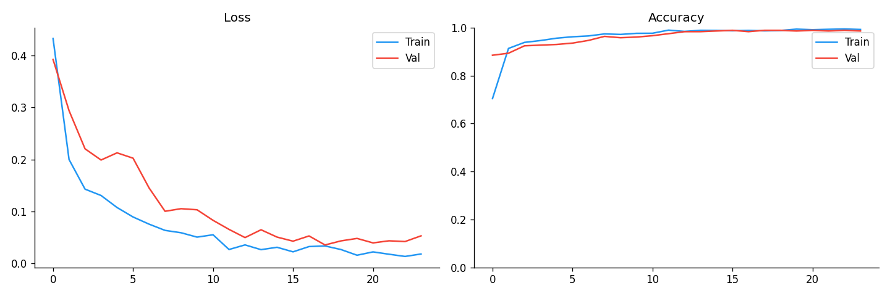
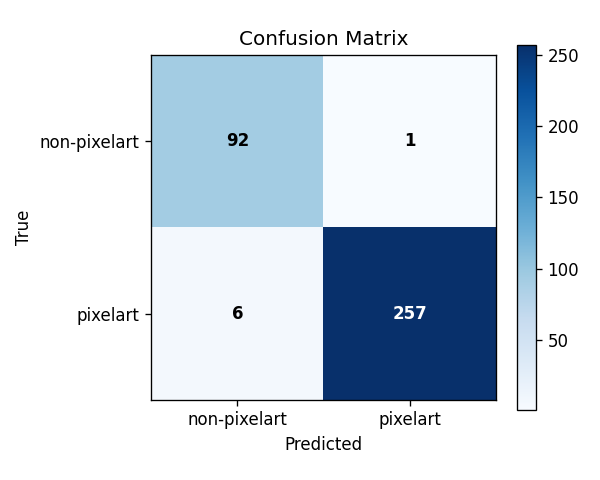

# Training Report — Pixel Art Classifier

> Model: EfficientNet-B0 · Trained: 2026-03-06 · Output: `train_output/`

---

## 1. Results Summary

| Metric | Value |
|---|---|
| Best val accuracy | **98.88 %** |
| Test accuracy | **98.03 %** |
| Epochs run | 24 / 40 (early stop) |
| Stopped by | EarlyStopping (patience = 8) |

The 0.85 pp gap between val and test accuracy is within normal variance for a dataset of this size — no signs of overfitting to the validation set.

---

## 2. Training Curves



**Loss** — both train and val loss drop steeply in the first 5 epochs (head-only warmup phase), then continue declining after backbone unfreeze at epoch 6. Val loss plateaus around epoch 15 and stays flat; train loss keeps falling slightly, producing the small gap visible in later epochs. The gap is modest and stable — not diverging — so the model generalises well.

**Accuracy** — val accuracy leads train accuracy in early epochs (expected: `WeightedRandomSampler` makes training harder by oversampling the minority class, while val uses the natural distribution). Both converge above 98 % by epoch 10 and remain tightly coupled through to early stopping.

---

## 3. Confusion Matrix



|  | Predicted non-pixelart | Predicted pixelart |
|---|---|---|
| **True non-pixelart** | 92 ✅ | 1 ❌ |
| **True pixelart** | 6 ❌ | 257 ✅ |

**Total test samples: 356**

| Class | Precision | Recall | Notes |
|---|---|---|---|
| non-pixelart | 93.9 % | 98.9 % | 1 false positive |
| pixelart | 99.6 % | 97.7 % | 6 false negatives |

The 6 pixelart images misclassified as non-pixelart are the more interesting error: these are likely high-resolution pixel art exports or images with large palettes (as flagged in EDA — some pixel art had unexpectedly high colour counts). The single non-pixelart false positive is negligible.

---

## 4. Configuration

```json
{
  "img_size"        : 224,
  "epochs"          : 40,
  "batch_size"      : 32,
  "lr"              : 1e-4,
  "weight_decay"    : 1e-4,
  "patience"        : 8,
  "val_split"       : 0.10,
  "test_split"      : 0.10,
  "use_amp"         : false,
  "use_class_weight": true,
  "seed"            : 42
}
```

---

## 5. Training Timeline

| Phase | Epochs | What happened |
|---|---|---|
| Head warmup | 1 – 5 | Backbone frozen; only classifier head trained at `lr = 1e-4` |
| Full fine-tune | 6 – 24 | Backbone unfrozen; backbone LR = `1e-5`, head LR = `1e-4` |
| Early stop | ep 24 | Val acc hadn't improved for 8 consecutive epochs |

Best checkpoint saved at the epoch with `val_acc = 98.88 %` and loaded automatically for test evaluation.

---

## 6. File Index

```
train_output/
├── best_model.pth        — full checkpoint (weights + class_to_idx + cfg)
├── results.json          — val/test accuracy, epochs, timestamp, cfg
├── training_curves.png   — loss & accuracy over epochs
├── confusion_matrix.png  — test-set confusion matrix
└── split_data/           — cached train/val/test file split (seed=42)
    ├── train/
    ├── val/
    └── test/
```

> **Note:** delete `split_data/` and re-run `train.py` if the source dataset is modified (e.g. after duplicate removal).

---

## 7. Deployment

The saved checkpoint is consumed directly by `server.py`:

```python
# server.py loads this path at startup
DEFAULT_CKPT = Path(__file__).parent / "train_output" / "best_model.pth"
```

The checkpoint bundles `class_to_idx`, `cfg` (including `img_size`), and `val_acc`, so `server.py` requires no manual configuration — it reconstructs the transform and label map automatically from the checkpoint.